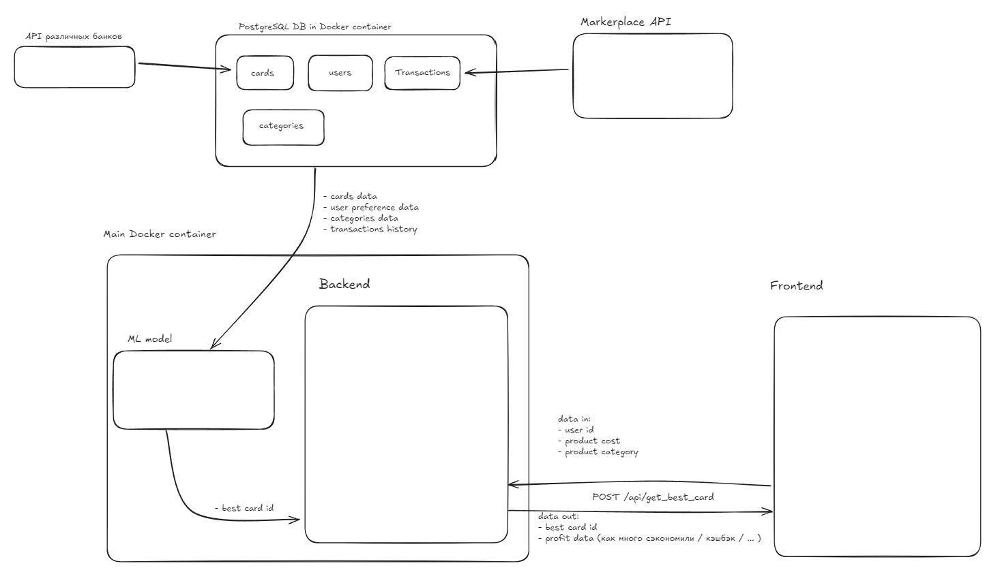

# Работа над задачей

## Фурмалеровка проблемы
У пользователей с несколькими кредитными картами часто возникает сложность в выборе наиболее выгодной карты для каждой покупки. Разные карты предлагают различные условия: кэшбэк, бонусы, льготные периоды, проценты на остаток и специальные предложения для определенных категорий трат (например, рестораны, транспорт, супермаркеты). Однако отсутствие удобного инструмента для анализа этих условий приводит к тому, что пользователи теряют потенциальную выгоду, выбирая неоптимальные карты

## Провокация
Как создать систему, которая поможет пользователям автоматически выбирать лучшую кредитную карту для каждой покупки на основе текущих условий (проценты, кэшбэк, бонусы) и предпочтений пользователя? Представьте, что система не только анализирует условия карт, но и учитывает типы трат, частоту использования карт и даже персональные приоритеты пользователя (например, важность кэшбэка или накопления миль). Какие технологии можно использовать для создания такой системы? Возможно ли интегрировать ее в существующие платежные процессы (например, через мобильное приложение или онлайн-банкинг)?

## Общее видение решения

...

## Хранение данных

Хранение данных осуществляется в PostgreSQL.

Таблица Карт

| id | name : varchar(255) | category_sale : json_data | interest_on_loan : smallint | category_cashback : json_data | bank : varchar(255) | rating : smallint |

Таблица Пользователей

| id | name : varchar(255) | money : integer | cashback_importance : smallint |

Таблица транзакций

| id | name : varchar(255) |

Таблица категорий

| id | name : varchar(255) |

## Описание модели

...

## Архитектура

## Используемый стэк

- Git | Github
- PostgreSQL
- Docker

## Оценка интегрируемости в существующую систему

...

